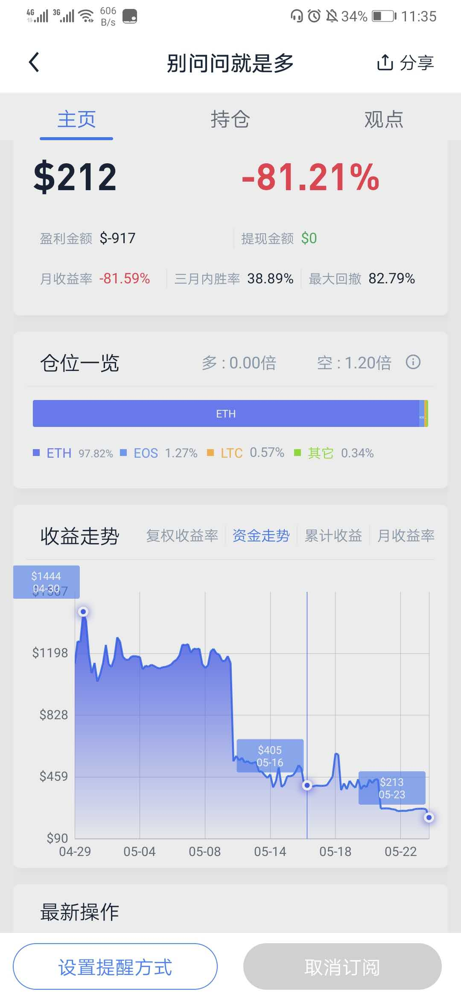

# 写在前面
这是第一次实盘实录过程，我将在这里做具体的说明跟记录以及总结，并且把我的经验作为持续改进新增到我的交易系统中去。

* 资金管理策略
* 交易计划
* 成交记录
* 实盘曲线
* 总结归纳

交易品种：ETH/USD

### 资金管理策略

> 固定比率资金管理策略

固定比率资金管理的核心：
>为自己定制一个增量，只有每个可交易合同数都盈利该增量时候才可以增加合同数，反之需要减少可交易合同数

1. 定制自己的增量
2. 定义标准化单位一份合同金额

余额 $800，
定义：
* 一份合同 = 4000U；
* 增量：$500

余额|累计盈利|需要盈利|可交易合同数
----|----|----|----|
800|0|0|1
1300|500|500|2
2300|1500|1000|3
4800|3000|1500|4

# 2020-05-23

## 实盘曲线

## 交易计划

做多计划：217.16入场 211.00止损
做空计划：183.66入场 193.07止损

制定计划委托
- 做空计划委托
  - 触发价格：178.560
- 做空止损计划委托
  - 触发价格：181.888

- 做多计划委托
  - 触发价格：219.580
- 做多止损计划委托
  - 触发价格：210.470
 
# 2020-05-30

这里快月末了，写个月末总结。

## 思考🤔

价格一直处在一个大区间几个小区间运动，作为趋势跟踪交易，出现了不断入场不断止损又入场又止损。

> 亏损源：不断假突破的入场止损。盈利变亏损，我认为或许我应该优化「防守止损」
> 我认为我应该优化趋势跟踪交易系统应该减少次数，这样似乎就能减少这种区间震荡假突破带来的亏损。

目前没有想到合适的解决办法，对于区间震荡的假突破产生的入场跟止损带来的亏损按照目前实盘来说是我无法回避必须要解决的一个问题。或许我可能从下面两个方向去思考：

- 降低仓位
- 优化防守止损
- 优化止损位置
- 减少交易次数（假突破交易次数,但是只有突破失败后你才知道这是假突破）

### 降低仓位

「降低仓位」这个应该是一个不错的方案，头寸规模是由资金管理系统决定的（亏损时候降低仓位），资金管理系统面临一个必须解决的问题：目前没有针对亏损到低于本金时候降低头寸规模的管理。
一开始我认为是没必要的，很重要的一个原因是我很自信我能快速盈利并扩大头寸规模（换句话说我居然自信的以为我太可能在较长时间内处于浮亏状态）。这是一个需要深入思考的问题！

> - 是否有必要在亏损到低于本金时候降低头寸规模？（换句话说:是否有必要在亏损到低于本金的时候进行资金管理。这样说显然就是有必要的！）
> - 我应该如何管理既要能降低头寸规模以减少亏损同时又要使我拥有较强快速赢回亏损的能力？（降低头寸规模可以减少亏损同时也会降低我赢回亏损的能力如何找到我能接受的平衡点？）

### 优化防守止损
交易开时候我做了如下判定：
「趋势开始」判定，同时也做了「趋势失败」的判定，分别对应了「入场价」与「止损价」。
目前关于「防守止损」的定义：
在「趋势开始」之后我们会有对于「趋势结束」的判定，每一个「趋势结束」的判定都是一个「防守止损」。

> 为了简化「趋势成功」没有判定，只要没有判定为「趋势失败」那就是「趋势成功」

但是市场是变化的，是否存在，在我们判定「趋势开始」之后存在一种可能有“新的「趋势失败」的判定并且能反应到一个具体的价格”。所以他也应该成为防守止损的一部分。

> 「趋势开始」后我应该持续跟踪建立起跟踪「趋势失败」的判定。应该满足一下原则

- 逻辑简单清晰并且客观（能够杜绝主观臆测）
- 尽可能的精（要合理反应「趋势失败」）少（只能有一两个这种「趋势失败」的防守止损位置）

判定依据（试行需要持续改进和优化）
- 关键阻力/压力位置 无法有效突破
- 收敛之后的反向突破

### 优化止损位置

「优化止损位置」我应该优化止损位置，换句话说我应该优化反应「趋势失败」的价格。我需要去找到具体的清晰的逻辑来完成这件事。做这件事我认为应该需要回答一下问题：

- 价格反应「趋势失败」的逻辑是什么？
- 是否能做到尽可能的避免掉主观的随机判断？

目前判定趋势失败（止损价格）的逻辑：
- 价格运动回「起涨点(起跌点)」  ——  起涨点/起跌点
- 价格跌破/突破原整理区间的下沿/上沿  ——  区间阻力/支撑

要解决这个问题或许我应该先做：如何定义「假突破」？
> 价格突破了，又回去了，突破无效是假突破
如果「假突破」的判定过于严格，我的交易次数就会被大大增加，我没有这么多精力跟时间去时刻跟踪市场。
所以我应该做出如下定义：
> 价格运动到我判定反应「趋势开始」这件事的价格，随后价格再次运动到我判定反应「趋势失败」这件事的价格   ————假突破

主要矛盾变成了`我如何优化对「趋势失败」的判定以及它与价格的逻辑关系`  （目前没有想到好的解决办法只能先余着）。

### 减少交易次数

> 我认为我应该优化趋势跟踪交易系统应该减少次数，这样似乎就能减少这种区间震荡假突破带来的亏损。

当我深入思考上面这个问题时候，确实可以通过减少交易次数来降低亏损，问题在于在「趋势失败」的判定之前你无法知道是真突破还是假突破，你只能假设每次突破都是真突破。否则你可能会错失一场趋势行情，显然这是作为趋势跟踪的交易者无法接受的。或者我可以从其他角度思考

交易盈亏的来源是波动率，做的就是波动率，我们定义波动率有周期，就跟我们玩游戏的技能 CD 一样，波动率也需要冷却。同时价格运动是市场合力的结果，所以我们先做出如下定义：

> 一场大波动发生后市场需要进入震荡来使得波动率冷却，以此来酝酿下一次的大波动。
> 价格的运动方向是市场合力的结果，当市场的作用力发生分歧的时候市场就会进入区间震荡直到各个作用力产生新的合力推动价格继续向单一方向运动

基于我们对上面两条的认可（理论依据）
或可通过 移动平均线、真实波动率、量价的收敛 来作预期
在 
 - 移动平均线走平
 - 真实波动率冷却
 - 量价收敛
的情况下我们判定「趋势开始」后「趋势有效」的权重进行提高，再达到这个条件阀值之前我们应该对于「趋势开始」的判定更为严格(试行)

* 入场价在原有基础上 上移（做多）或下移（做空）
* 止损价在原有基础上 必须满足区间下沿不能过远，如果过远应该选择不要交易或者移动到入场价下方

## 2020-06-05

### bch

决定再新开一个账户用于交易 bch ， 如下附上交易计划

(交易计划)[https://www.tradingview.com/x/MPaK1Ich/]

> 由于仓位较大所以止损的安排上面选择了1个ATR。尽管如此任然只能有8次的交易机会，由于没有针对低于本金后的资金管理，在8次止损后必然面临破产

